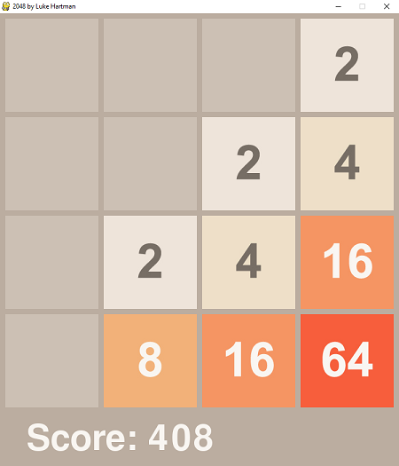
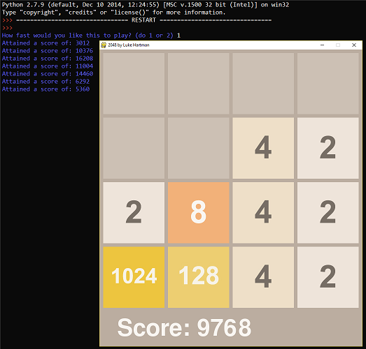

# 2048

Simple recreation of the 2048 app I made when I was in highschool.
I created the images based on the app.

I also included a bot I made which plays the game. About human level performance (better than me), but I didn't put too much time into it before moving on and I made it before learning much about modern game playing algorithms.
(Also made during high school)

Use Python 2.7 and Pygame to run.
Arrow keys to play.

Bot Playing:

