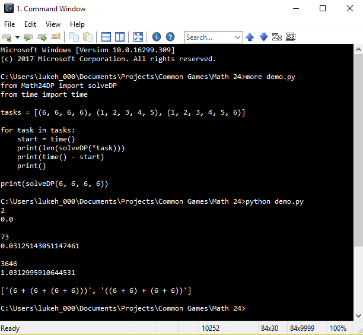

# Math 24

This one is one of my favorites. "Math24.py" is my first attempt (high school) to make a solver for the game, and "Math24DP.py" is my more recent (last year) revisiting the problem after learning how to do dynamic programming in "CS577 Introduction to Algorithms"

The time complexity of both is still NP, but running comparisons shows that my more recent attempt is much faster, and could be run if I took advantage of libraries such as itertools and numpy.

Additionally there are a lot of optional speedups I implemented in the DP version, such as there are some problems which can only be solved by using fractions at some point during the computation, but if you don't care about these solutions you can speed up considerably. All speedups are by default enabled.
Using all the speedups allows me to find all solutions to problems with 6 numbers in about one second.

Run with Python 2.7+

