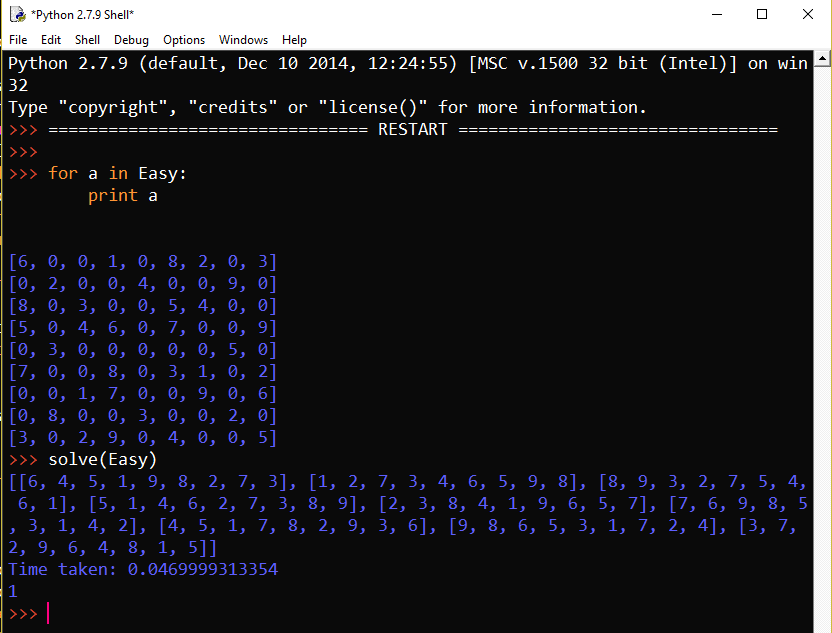
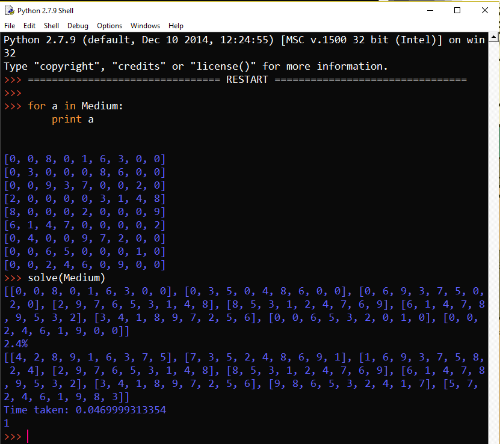
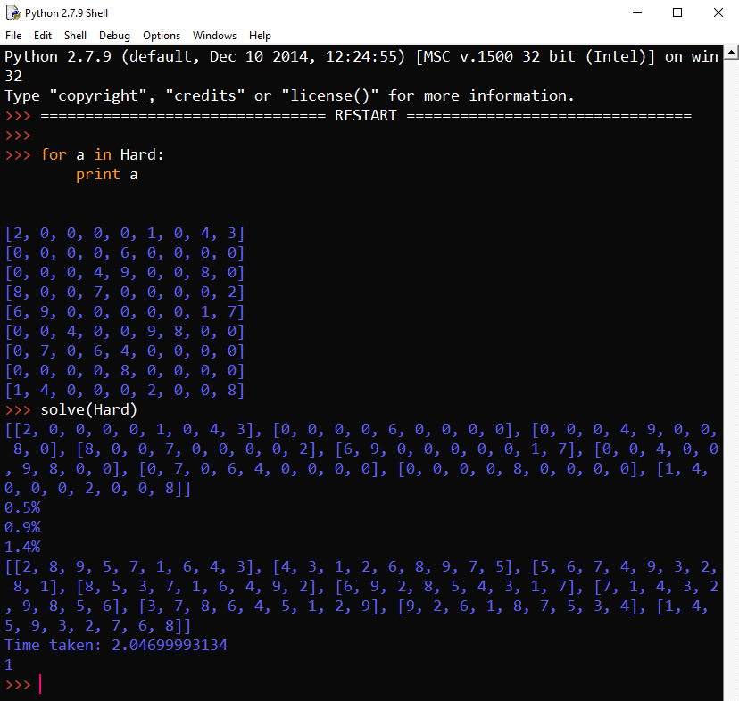

# Sudoku

Sudoku is great. It is one of my favorite games to mess around with, and a great challenge for aspiring programmers. I love thinking of and learning new ways to find solutions from simple backtracking to integer programming. I have included a solver I made in high school, in Python, and a folder full of ideas and algorithms I made in Java which are in various states of completion.

### Runs of python program:

