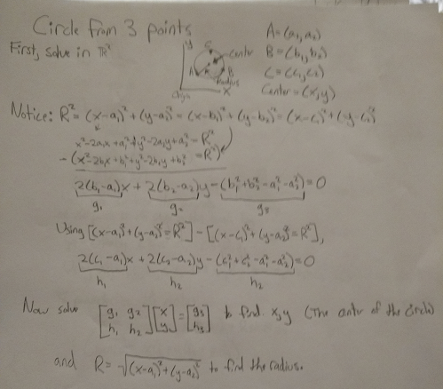
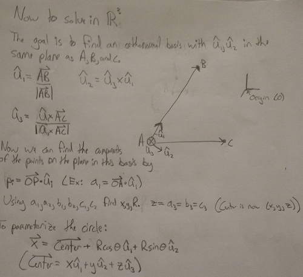
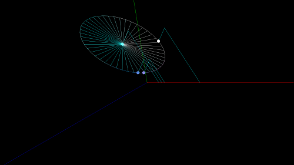

# Fancy Circle

# [Open in your browser.](https://luke-hartman.github.io/Personal-Projects/Computer%20Graphics/Fancy%20Circle/RealFancyCircle.html)

I especially like this one, since the prompt was just to do anything in Canvas (it was the first assignment of the class, a simple "Hello World" would have worked) so I recreated a program I made in Python in JavaScript.
Both are included as well as the math to show how it works.

Python code requires 2.7, and Pygame.
Use WASD to move

[Assignment specifications](http://graphics.cs.wisc.edu/WP/cs559-sp2017/2017/01/17/programming-assignment-1-intro-to-html-canvas/)

## Derivation



## Python Screenshot

