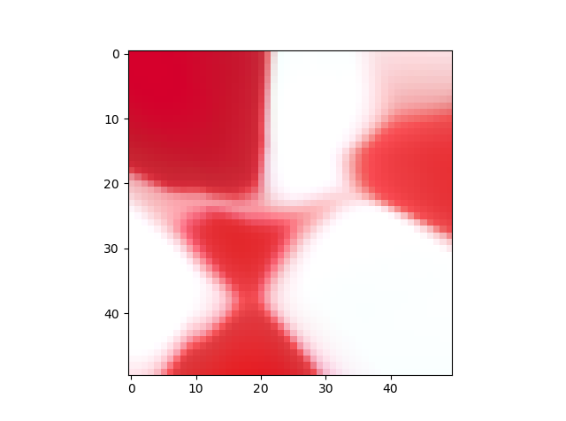
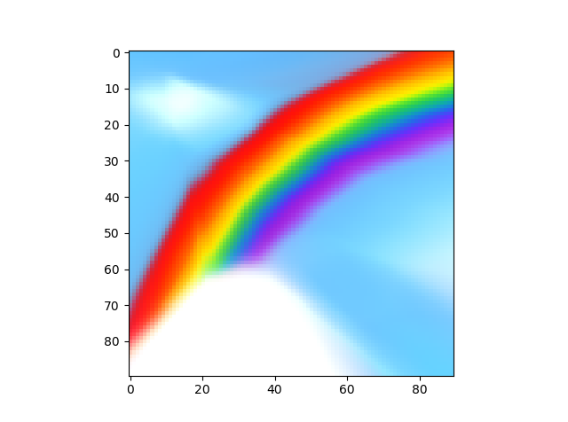

# Neural Net Image Regression

This program takes an image and trains a neural net to predict the color of a pixel with the given (x, y) coordinates where 0 <= x, y <= 1

I made it after making "Visualize Active Learning" and becoming more interested in Neural Nets.

Here are some pretty pictures of Neural Nets of learning some of the images. (An equal amount of training happens between every two pictures for the same image)

This is mainly for interacting with to build intuitions, so I encourage messing with the program rather than leaving it in its current state.

Running requires Python 3.6, keras

## Images/mediumStraight.png

## Images/rainbow.png

