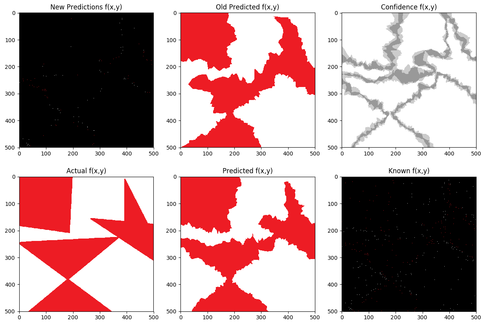
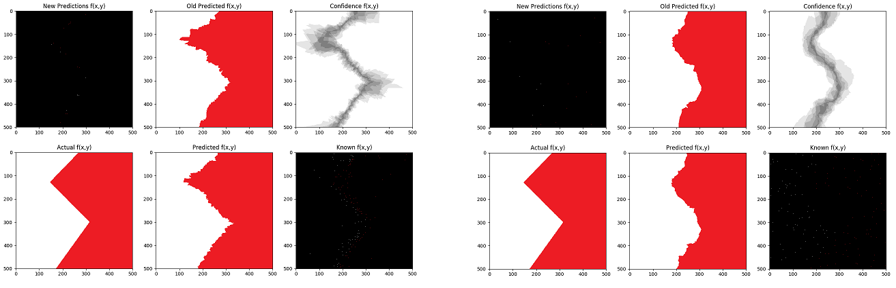

# Visualize Active Learning

## To use
Requires Python 3.6, sklearn

python visualizeActiveLearning.py

I have the program visualizing the training of a 5 nearest neighbor clasifier while using the random forest algorithm for selecting new features to select new training samples.

## Summary
Uses a really crude method for experimenting with Active Learning.
You can put in any classifier which uses the sklearn classifier interface (just fit, predict, and it can visualize predict_probas if you remove the comments)
You can also put in any method to take in X, Y training data (X being feature vectors, and Y being targets) and produce new X values to get the values of.
 
I used images with small numbers of colors which served as the ground truth where the models where trying to learn the mapping from i, j coordinates (scaled to 0-1) to the colors.
When the active learning algorithm selects points to query, it fetches the correct labels from the image. This could be extended by adding noise or selecting the nearest available sample to get a label,
but this easiest version has a noiseless oracle.

## Interface
Has a really rough interface. The program stalls whenever it finishes a batch from the active learning algorithm, and opens up an image in matplotlib. Close the image to continue the program.

## Different Active Learning Algorithms

In practice, the Random Forest Algorithm performed better than the others examined. (Classifiers where able to learn with fewer samples)
All of the algorithms are in principle vulnerable to missing regions of a class and never sampling in it. This can be seen in Example 2.

### Random Forest Algorithm
Uses query by commitee/uncertianty sampling depending on your perspective with a Random Forest. It builds a random forest on the X, Y data provided, and then tries to find enough points where enough of the random forest disagrees.
#### Important Notes
This is not implemented very carefully. It is possible for it to never terminate if the random forest is more confident than the threshold for every point. Additionally, there are more efficient ways to find the points the random forest is least confident.

### Leaving Algorithm
Uses the heuristic that areas leaves of the decision tree are equally important, so it samples randomly in random leaves. Major failures of this heuristic are that not all leaves touch the decision boundary, and also that it may cause edges which are not aligned with the axis of splits to be given far more attention.

### Pet Algorithm
Samples along the decision boundary of a decision tree, an older version tried to also sample uniformly. The latest version I tested builds a new decision tree for every few samples in the batch to prevent sampling too densely along the decision boundary of a single decision tree.

## Examples
### Run on Medium Straight with speed = 250, RandomForestAlgorithm for sampling, and kNN with k=5 for the visualization.
### 1.

### 2.

### 3.

### 4.

### Run on Rishi with speed = 500, RandomForestAlgorithm for sampling, and a Random Forest 100 trees for the visualization.
### 1.

### 2.

### 3.

### 4.

### 5.

### 6.

### Run on zigzag with speed=50. It compares running 10NN getting new samples with the Random Forest Algorithm (left) vs Randomly (right).
### 1.

### 2.

### 3.

### 4.

### 5.

### 6.

