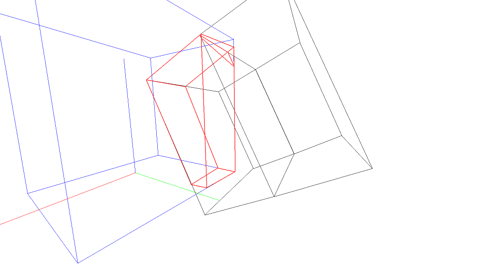
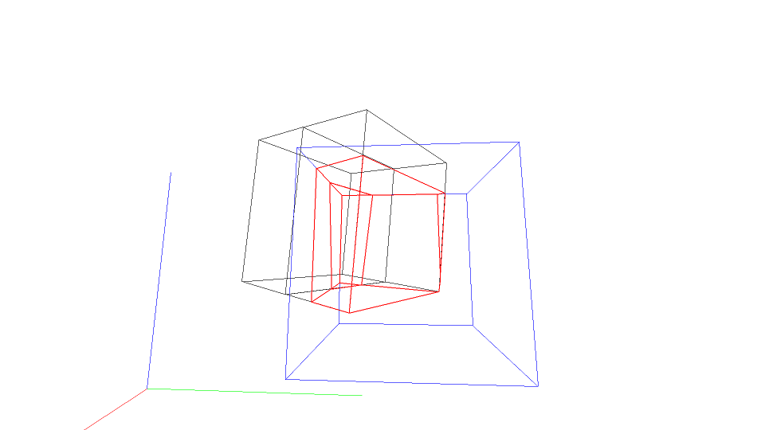
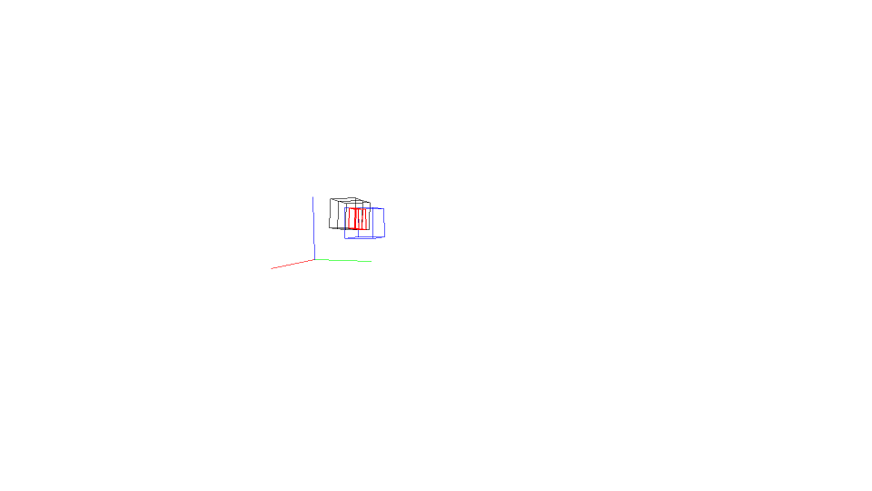

# 3D Collisions

I made this while taking the class CS525 - Linear Programming at UW Madison. It implements the simplex algorithm studied in class and uses it to visualize collisions in a 3D environment.
I also made the 3D perspective using a simple model of the geometry before learning the best practices in CS559 - Computer Graphics, so they may look a little off.

It works by defining each object as a union of linear constraints (one for each face). Collisions are then the union of the object's constraints (which is the intersection of the feasible regions).

WASD to move, mouse to look around, arrow keys and ctrl/space to move object. When the object moves, it faces the same direction as the camera.

requires Python 2.7, Pygame

run Game/Main.py



