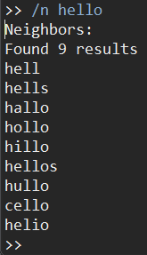
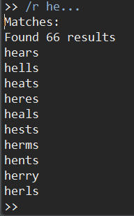
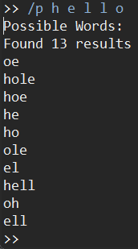
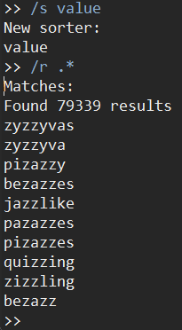
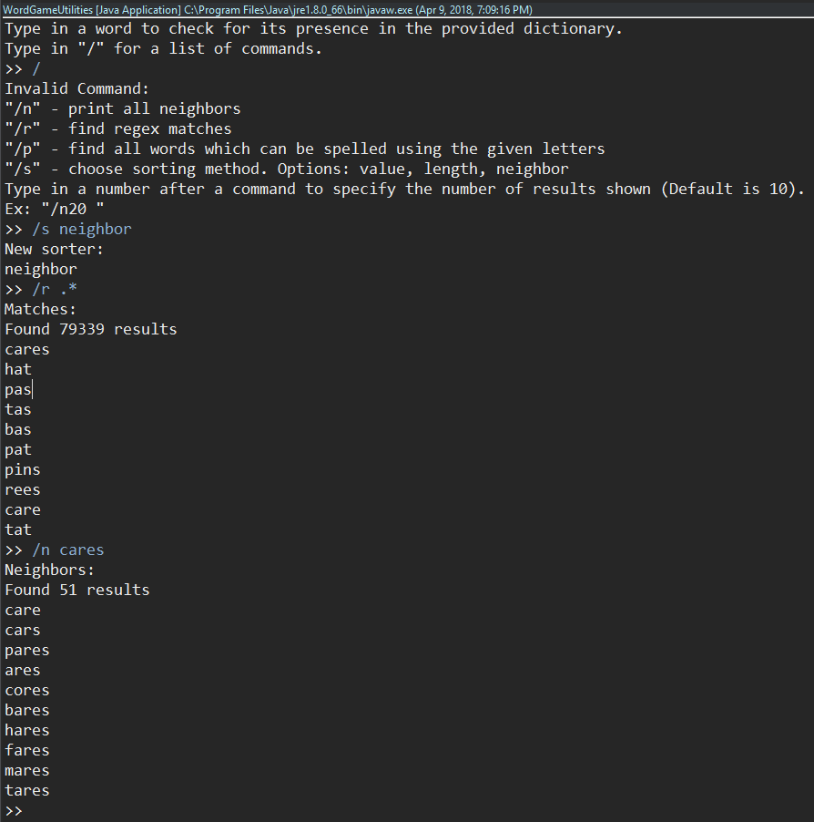

# Word Game Utilities

Uses a provided dictionary, (I provided the official Scrabble dictionary with the program)
to perform various functions.

### /n Find all the neighbors of a word. (Add, remove, or change one letter)

### /r Find all words matching a regular expression

### /p Find all words that can be spelled using the given letters

### /s Change sorting method. Options value, length, neighbor (value is Scrabble points)

### These can be combined to many uses.
### For instance, lets find how many neighbors the word with the most neighbors has:
